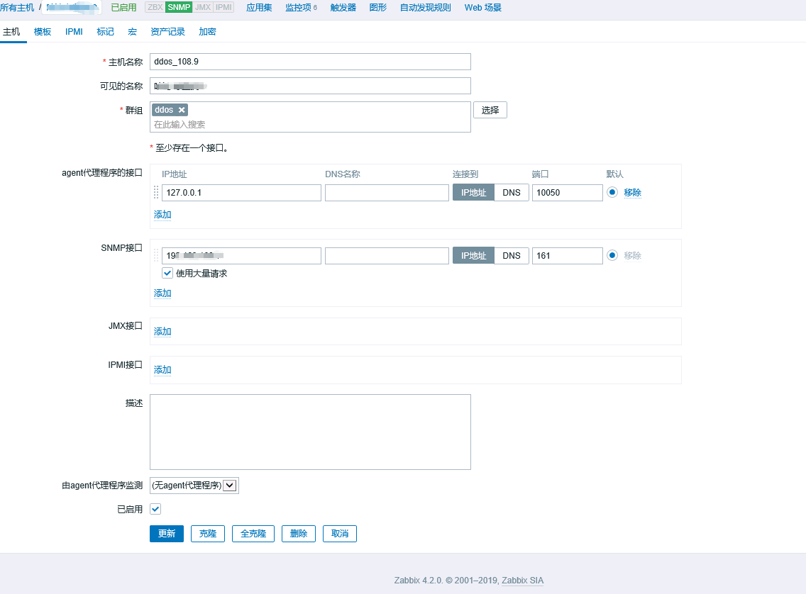
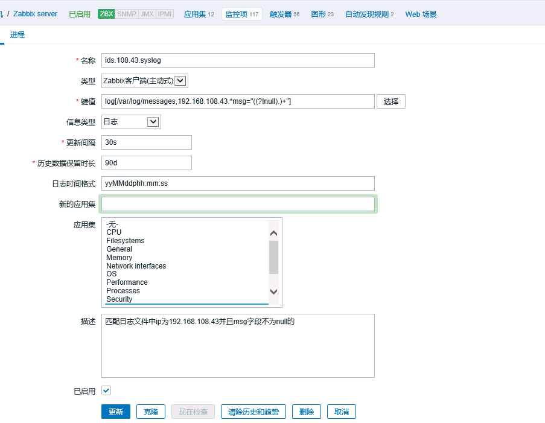

### 1、snmp方式监控
zabbix方式监控就不写了，默认会把装zabbix的机器自动监控，相关配置抄就可以了，主要说下snmp

#### 1.1 创建主机

配置--》主机 --》 创建主机

1. 主机名称：有限制，按约束填好就行
2. 可见名称：页面上看到的名称，可以为中文
3. 群组：按需要划分，主要是统计需求，不影响功能
4. agent代理接口：可不填，默认即可
5. **SNMP接口**：ip地址为被监控设备地址，端口一般是161，使用大量请求默认勾选
6. 配置宏，增加{$COMMUNITY}，密码填好
7. 其他默认，直接创建即可

#### 1.2 创建监控项

1. 名称：随意，通过校验即可
2. **类型**：按照实际情况，我是SNMPv2客户端
3. **键值**：这个比较重要且不能乱填，以下为例子：
    1. 监控cpu：system.cpu.util[,softwareVersion]
    2. 监控内存：system.cpu.util[,cpuMemory]
    3. 一般监控可以用此键值，第二项参数为type，不重复就好
4. 主机接口：根据主机情况默认填好的，ip+端口
5. **OID**：根据设备厂商提供填写，zabbix以snmpget命令的方式获取，可在linux中用snmpget命令测试
    - 注意一点，有些oid用get命令获取需要加.0，get以.0结束
6. community：根据设备设置填写
7. 其他随意，根据实际填写

### 2、监控日志文件

直接在对应主机创建监控项

1. 名称：随意
2. **类型**：选择‘zabbix客户端（主动）’
    - 需要安装zabbix agent
3. **键值**：log[/var/log/messages,192.168.108.43.*msg="((?!null).)+"]
    - 参数第一项为日志绝对路径
    - 第二项为配置的正则
    - 其他参数需要的时候自查
4. 信息类型：日志
5. 日志时间格式：yyMMddphh:mm:ss
6. 其他随意，按需填写

