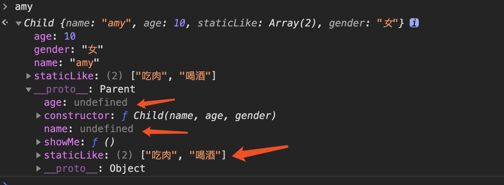
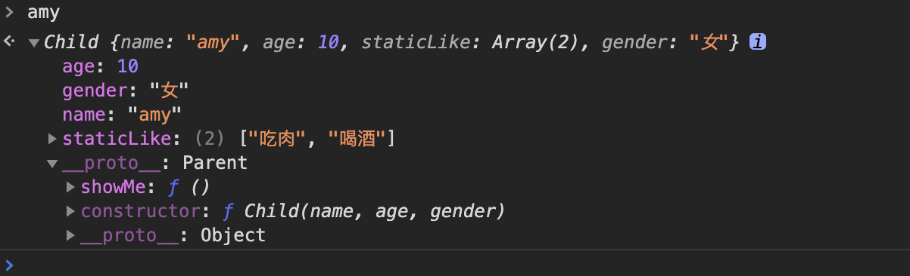

#### 前言

在我写文章之前照例在网上找了很多继承的文章看，大多数文章换汤不换药的写了六七种继承方式，然后标记每种继承方式的优缺点，知识点当然都说的够多，但我以为还是存在以下问题：

##### 1. 构造函数和类混为一谈

类就是类，既不是函数，也不是对象，它是单独抽象的一个概念，在面向对象中自有其地位

为什么现在很多公司要求前端开发人员也要会一门后端语言，就是因为只学JavaScript无法全面的理解面向对象，比如说类的概念...

##### 2. 没弄明白究竟什么是继承

很多文章根本连继承都没有定义，把对象a和对象b有方法和属性上的联系就称为继承，这也是相当不严谨的说法

这两点看似不重要，只是说法问题，但涉及到如何理解面向对象，这是基础概念，基础概念重要不重要，我认为是重要的

### 1、相关定义

基于前面的问题，我必须先在此明确讨论的基础：

<code>类</code>：严格来说js中并没有类的概念，es6中的class从用法来说确实可称为类，但核心依然基于原型与原型链，因此和基于类的面向对象有巨大的差别

因此，为避免混淆，除了写到class与excends的部分，其他时候一律不使用类的概念。

<code>继承</code>：不是什么阿猫阿狗都可以被称为继承，要想被称为继承，起码应该具备以下几个特点：

1. 儿子拥有父亲所有非私有的属性和方法；
2. 儿子可以有自己的属性和方法；
3. 儿子对父亲的方法可以有自己的实现；
4. 儿子不管怎么做不能影响到父亲；
5. 儿子之间不能互相影响；

这是最基本的继承的条件，这样看js中所谓的原型链继承、构造函数继承等根本不符合继承的特点，弊端太多，顶多可以叫缺胳膊短腿的继承

原型就是原型、构造函数就是构造函数、工厂模式就是工厂模式，它们已经有了明确的定义，不需要强行和继承拉郎配...

### 2、js如何实现一个简单的继承：原型+构造函数

我们根据上文提到的继承的基础特点，结合原型链来实现继承：

1. 儿子的原型需要指向父亲，这样才可以访问到父亲的属性和方法——原型指向及绑定this
2. 每个儿子对象都需要维护自己的一套变量，这样才不会影响的父亲和其他儿子——新对象

具体实现如下：

```js
//定义一个构造函数用来代表父亲
function Parent(name,age) {
	this.name = name;
	this.age = age;
	this.staticLike = ['吃肉','喝酒'];
}

//父亲具备的方法
Parent.prototype.show = function () {
	console.log('我的名字是： ',this.name,'，年龄是：',this.age)
}

//定义一个构造函数用来代表孩子
function Child(name, age, gender) {
	Parent.call(this,name,age); //继承了父亲的属性，但是this指向孩子
	this.gender = gender;
}

Child.prototype = new Parent(); //原型指向
Child.prototype.constructor = Child; //重新指定原型后需要手动设置constructor

//孩子具备的方法
Child.prototype.showMe = function(){
	console.log('我的名字是： ',this.name,'，年龄是：',this.age,'，性别是：',this.gender)
}

let allen = new Child('allen',12,'男');
let amy = new Child('amy',10,'女');

allen.staticLike.push('打牌');

console.log(allen.staticLike); //['吃肉','喝酒','打牌']
console.log(amy.staticLike); //['吃肉','喝酒']

allen.show(); //我的名字是：  allen ，年龄是： 12
allen.showMe(); //我的名字是：  allen ，年龄是： 12 ，性别是： 男
amy.showMe(); //我的名字是：  amy ，年龄是： 10 ，性别是： 女
```

也许你一看这不就是别人说的组合式继承么，没错，最简单的也是最起码的继承就是上面的这种写法

它实现了开头那几点继承的定义，它们之间的关系是真·继承

但这种写法仍有缺陷，为了实现继承，我们多new了一个对象

```js
Child.prototype = new Parent();
```
主要因为Parent是一个函数，无法充当原型，所以我们之后new了一个对象，让这个对象充当allen和amy的原型

但是此原型对象的属性是冗余的




总的来说，它简单易理解的实现了继承，是最常用的继承方式

### 3、没有明显缺陷的继承：寄生组合式继承

上述实现继承的方法主要问题是多new了一个对象，原型上的属性为冗余属性，内存方面多少有所浪费，那么我们有没有办法解决这个问题？

答案是肯定的，并且不只有一种实现

简单的实现是把原来的<code>Child.prototype = new Parent();</code>方式改写为Object.create()方式，实现如下：


```js
//定义一个构造函数用来代表父亲
function Parent(name,age) {
	this.name = name;
	this.age = age;
	this.staticLike = ['吃肉','喝酒'];
}

//父亲具备的方法
Parent.prototype.show = function () {
	console.log('我的名字是： ',this.name,'，年龄是：',this.age)
}

//定义一个构造函数用来代表孩子
function Child(name, age, gender) {
	Parent.call(this,name,age); //继承了父亲的属性，但是this指向孩子
	this.gender = gender;
}

// Child.prototype = new Parent(); //原型指向
// Child.prototype.constructor = Child; //重新指定原型后需要手动设置constructor

//具体描述符意义可见MDN：https://developer.mozilla.org/zh-CN/docs/Web/JavaScript/Reference/Global_Objects/Object/defineProperty
Child.prototype = Object.create(Parent.prototype,{
	constructor: {
		value: Child,
		enumerable: false, //不可枚举
		writable: true,
		configurable: true
	}
})

//孩子具备的方法
Child.prototype.showMe = function(){
	console.log('我的名字是： ',this.name,'，年龄是：',this.age,'，性别是：',this.gender)
}

let allen = new Child('allen',12,'男');
let amy = new Child('amy',10,'女');

allen.staticLike.push('打牌');

console.log(allen.staticLike); //['吃肉','喝酒','打牌']
console.log(amy.staticLike); //['吃肉','喝酒']

allen.show(); //我的名字是：  allen ，年龄是： 12
allen.showMe(); //我的名字是：  allen ，年龄是： 12 ，性别是： 男
amy.showMe(); //我的名字是：  amy ，年龄是： 10 ，性别是： 女
```

上述代码只是将注释掉的两行换了写法，结果如下：



没有了冗余属性

另一种方式是手动实现，用没有属性但链接了原型的空函数替代Parent，核心代码是：


```js
inheritPrototype(Child, Parent)

function inheritPrototype(childFunc, parentFunc) {
	let prototype = realizeInheritance(parentFunc.prototype)   //创建原型对象
	prototype.constructor = childFunc              //绑定constructor
	childFunc.prototype = prototype                //指向原型
}
function realizeInheritance(parent) {
	// 临时函数
	function tempFunc() {}
	tempFunc.prototype = parent
	return new tempFunc()
}
```

这种实现方法优化了第一种的弊端，更完善的实现了继承

### 4、class，extends，super

es6提出了类的概念，并且用extends关键字实现了继承，其实现方式与寄生组合式实现类似

之前的方法都是为了更好的理解js语言，实际开发当然是直接用class，extends，super一套带走...


```js
class Parent{
	constructor(name,age){
		this.name = name;
		this.age = age;
		this.staticLike = ['吃肉','喝酒'];
    }

    show(){
		console.log('我的名字是： ',this.name,'，年龄是：',this.age)
    }
}

class Child extends Parent{
	constructor(name,age,gender) {
		super(name,age);
		this.gender = gender;
	}

	showMe(){
		console.log('我的名字是： ',this.name,'，年龄是：',this.age,'，性别是：',this.gender)
    }
}

let allen = new Child('allen',12,'男');
let amy = new Child('amy',10,'女');

allen.staticLike.push('打牌');

console.log(allen.staticLike); //['吃肉','喝酒','打牌']
console.log(amy.staticLike); //['吃肉','喝酒']

allen.show(); //我的名字是：  allen ，年龄是： 12
allen.showMe(); //我的名字是：  allen ，年龄是： 12 ，性别是： 男
amy.showMe(); //我的名字是：  amy ，年龄是： 10 ，性别是： 女
```

与众多后端语言写法一样，无甚好说，但要知道，js实际上做的还是函数、原型那一套东西

最后再强调一遍：JavaScript没有类，只有和类相同的写法。