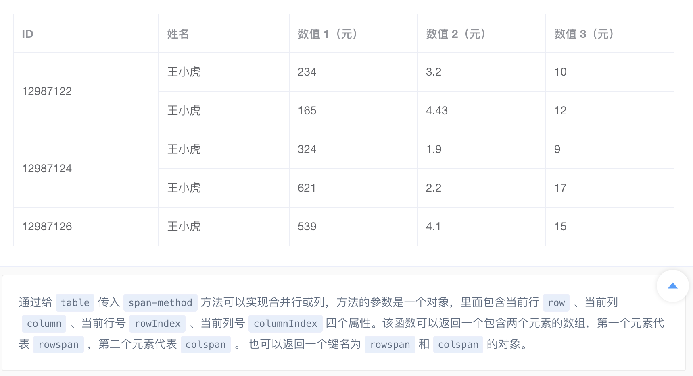

#### 前言
element的<code>el-table</code>提供了列表组件，组件支持行和列的合并，但没办法自动将相同内容合并为一列，需要手动来指定

> 通过给table传入span-method方法可以实现合并行或列，方法的参数是一个对象，里面包含当前行row、当前列column、当前行号rowIndex、当前列号columnIndex四个属性。该函数可以返回一个包含两个元素的数组，第一个元素代表rowspan，第二个元素代表colspan。 也可以返回一个键名为rowspan和colspan的对象。

本文据此接口实现动态列的合并



#### 1、template

```r
<el-table
        :data="list"
        border
        stripe
        //合并行或列
        :span-method="mergeCategory"
        :header-cell-style="{background:'#dfe9fc'}"
        style="width: 100%;overflow: auto;">
    <el-table-column
            prop="category"
            label="类别"
            align="center"
            width="210">
    </el-table-column>
    <el-table-column
            prop="itemName"
            label="检测项"
            width="200">
    </el-table-column>
</el-table>
```


#### 2、script

##### 2.1、先用两个数组存放相同项的个数，这俩个数组在获取列表数据的时候遍历填充
```js
data() {
	return {
	    //...
	    //分类相同项个数，数组
        margeCategoryArr: [], 
        //检测项相同项个数，数组
        margeItemNameArr: [] 
	}
},
```
##### 2.2、遍历list，计算内容相同的行数，放入数组：

```js
//list为后端返回数据，省略查询步骤

let tempCategory = 1,tempItemName = 1, 

//记录相同行的个数
for(let i = 0; i < list.length-1 ; i ++){

    //处理‘类别’列
	// 前一项和后一项内容相等
	if(list[i].category === list[i+1].category){
	    //边界
		if(i === list.length -2){
			tempCategory = tempCategory +2;
        }else{
			++tempCategory;
        }
	}else{
		this.margeCategoryArr.push(tempCategory);
		//放入数组后重新开始计数
		tempCategory = 1;
	}

    //处理‘检测项’列
	if(list[i].itemName === list[i+1].itemName){
		if(i === list.length -2){
			tempItemName = tempItemName + 2;
        }else{
			++tempItemName;
        }
    }else{
		this.margeItemNameArr.push(tempItemName);
		tempItemName = 1;
    }
}

//将最后一次计数结果放入
this.margeCategoryArr.push(tempCategory);
this.margeItemNameArr.push(tempItemName);
```
##### 2.3、找到不同项下标与相同行数对应关系

> arr为data中的数组；
> 该对应关系用对象来完成

不同项下标 | 相同行数
---|---
0 | arr[0]
arr[0] | arr[1]
arr[0] + arr[1] | arr[2]
arr[0] + arr[1] + arr[2] | arr[3]
... | ...
getKey(n,arr) | arr[n]

##### getKey实现：

```js
//methods
getKey(n,arr){

	if(n === 0){
		return 0;
    }
	if(n === 1){
		return arr[0]
    }
	return this.getKey(n - 1,arr) + arr[n-1];

}
```
列表每页10条数据，层级最多10，数量不大用递归实现

##### mergeCategory实现：

```js
//methods
mergeCategory({ row, column, rowIndex, columnIndex }){

    //开始合并项和合并数对应
	let margeCategoryObj = {}, margeItemNameObj = {};

	this.margeCategoryArr.forEach((item,index,arr) => {
		margeCategoryObj[this.getKey(index,arr)] = arr[index];
    });
	this.margeItemNameArr.forEach((item,index,arr) =>{
		margeItemNameObj[this.getKey(index,arr)] = arr[index];
    });

    //合并分类
    //第一列
	if (columnIndex === 0) {
	    //记录是否需要合并
		let margeCategory = false;
		for(let item in margeCategoryObj){
			//当前行下标和需要合并行下标相等，需要合并
			if(rowIndex == item){

				margeCategory = true;
				
				return {
				    //得到合并数字
					rowspan: margeCategoryObj[item],
					colspan: 1
				};
            }
        }
		if(!margeCategory){
			return {
				rowspan: 0,
				colspan: 1
			};
        }
	}

	//合并检测项
	if (columnIndex === 1) {
		let margeItemName = false;
		console.log(margeItemNameObj);
		for(let item in margeItemNameObj){
			// console.log(rowIndex,item)
			if(rowIndex == item){

				margeItemName = true;
				// console.log('执行return',rowIndex,margeCategoryObj[item]);
				return {
					rowspan: margeItemNameObj[item],
					colspan: 1
				};
			}
		}
		if(!margeItemName){
			return {
				rowspan: 0,
				colspan: 1
			};
		}
	}

}
```
大功告成

